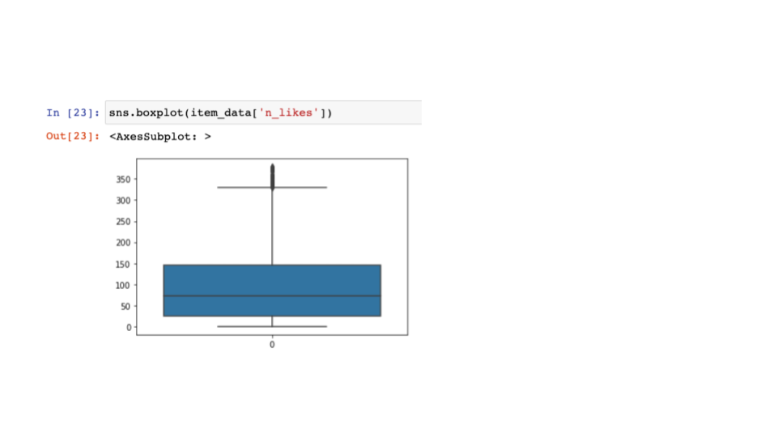
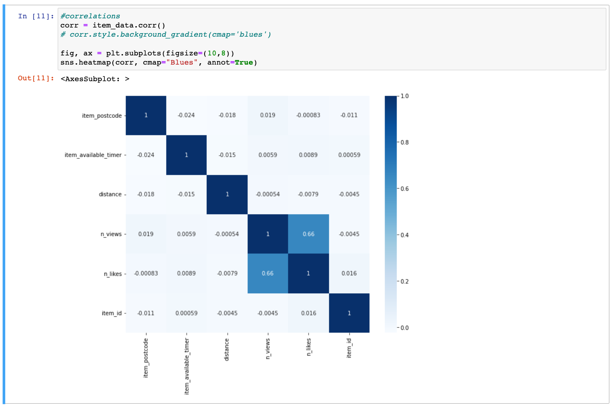
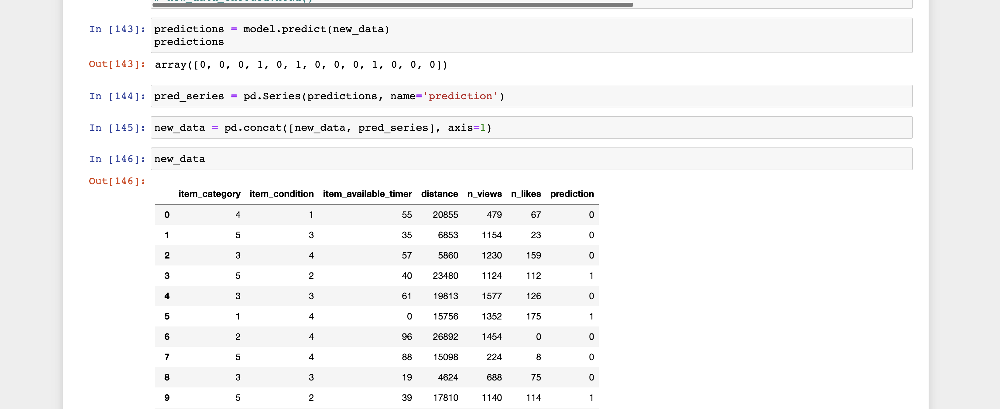
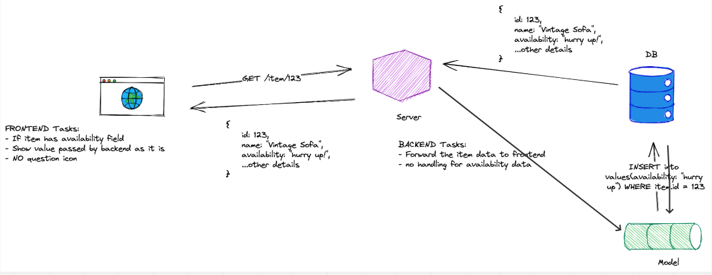

### Classification of items availability
**by [Karina Condeixa](https://github.com/KC2016)**

Browsing through similar websites(FreeYourStuff Berlin and E-Bay, I noticed many old posts offering items or searching for items, which are probably outdated. It is noticed that many users do not remove posts and neither do these websites.

 To give Geofree a good transaction metric that avoids keeping outdated items in the app, and spending resources on data maintenance, I propose the creation of a feature that classifies available/taken items and subsequently triggers the removal of unavailable items from the app.

For this, a RandomForestClassification is performed.  At first, a feature created by the designers is used to get initial data and train the model. My idea is to implement machine learning ML when it reaches good statistical metrics.

#### 1 Mock dataset
Creating fake datasets while the app was being developed was a tiring and painful process. As there were uncertainties regarding many features of the app and there was no standard for naming columns like the backend database, many versions and modifications had to be made to the mock datasets. After going back and forth on design features that affected the data I needed to work with, I decided to leave the code commented out and not delete it. It might look messy, but it avoided reworking.

#### 1.1 Dataset for the Classification ML model
Generally speaking, the dataset had 5000 records and was made under the following parameters:
```
maximun_n_views = 2001
pct_of_likes_over_views = 20
n_records_ranking = 5000
n_records = 5000
limit = '-30d'  # limit of 30 days of item in the app
maximun_n_hours_avalilable = 100

category = ['furniture',  'clothes',  'kitchen_utensils', 'kids', 'other']
condition = ['poor', 'acceptable', 'good', 'like_new']
available = ['1', '0']

```
#### 1.2 Dataset for testing this ML model
A small dataset with 15 records was done.

```
def new_data(n_records_new):
      # dictionary
    new_data ={}
    for i in range(0, n_records_new):
        new_data[i] = {}
#         item[i]['item_status'] = 1
        new_data[i]['item_category'] = np.random.choice(category)
#         new_data[i]['item_id'] = np.random.choice(range(1, n_records_new))
        new_data[i]['item_condition'] = np.random.choice(condition)
#         item[i]['item_available_timer'] = np.random.choice(n_hours_avalilable) # in 30 days
#         datetime_iteration1 = fake.date_between_dates(limit,'now')
#         datetime_iteration2 = fake.date_between_dates(limit,'now')
#         if datetime_iteration1 <= datetime_iteration2:
#             item[i]['item_timer'] = datetime_iteration1
#             item[i]['item_timer'] = datetime_iteration2
#         else:
#             item[i]['item_timer'] = datetime_iteration2
#             item[i]['item_timer'] = datetime_iteration1
#         new_data[i]['item_postcode'] = np.random.choice(postcodes_berlin_series)
            new_data[i]['item_available_timer'] = np.random.choice(n_hours_avalilable)
#         item[i]['item_timer'] = (date.today()) - fake.date_between_dates(limit,'now')  # in days, can be improved to hours
        new_data[i]['distance'] = np.random.choice(distance)

 # This date shold be later than the post
        new_data[i]['n_views'] = np.random.choice(n_views)
        new_data[i]['n_likes'] = int(new_data[i]['n_views'] * (np.random.choice(pct_likes)))
        new_data[i]['item_available'] = np.random.choice(available)

    return new_data
```
#### 2 EDA for Random Forest Classification¶

An exploratory analysis collect data on the following features from Geofree:
category condition, post's age (today - data posted), item-user distance, views, likes and Item availability (the target) and performance, and:

- Checks the variables and statistics
- Visualise the frequency of the categorical variables
- Visualises the correlation between variable
- Checks Outliers and if the dataset is balanced
- Creates a function to do all these steps

The main remarks about the EDA are:

- Only column `n_likes` presented outliers.



- A correlation between the number of likes and the number of views was expected, once it was added when I created the dataset when the `n_likes` column was based on a random percentage of the `n_views` column.



- The column item available is the one I am going to predict, it was not unbalanced. It was shown 2560 items were available and 2440 not available.
- Since our dataset was randomly created, so I am not interpreting the distributions.

#### 3 Random Forest Classification and metrics used

#### 3.1 Processing Data
Postcodes are variables with many categories. So, I dropped it. And droppen id too.
The categorical variables `available`, `category` and `conditions` were encoded to numbers.

#### 3.2 RandomForestClassification: iterations
A couple of iterations were made, splitting the database into 70-30 and 80-20 and varying `n_estimators`, `max_features`,  `max_depth` and  `max_sample`. The Accuracy, F1-score, Precision and Recall got deficient.

#### 3.3  Hyperparameter tuning
A  tuning of hyperparameters for the classifier was made looking to have the best performance. It shows the highest F1-score and Recall. But still, the metrics were weak (between 45% and 50%).

#### 3.4 Feature relevance
A randomizedSearchCV supported the most interesting accomplishment of the model, for now. It shows an order of importance among the columns: `distance`, `n_views`, `n_likes`, `item_available_timer`, `item_category`, `item_condition`, in descending order.

#### 3.5 Applying the ML model to new data
To test the model, a mock `new_data` dataset was applied. We can below a sample of the results.



#### 3.6 Suggestions for further improvement:
To improve the performance of the model, besides trying the default parameters, I could:
- Check the metrics Cross-validation and AUC-ROC
- Use also gridsearch to improve the metrics
- Compare alternative models using Pycaret
- Implement the ML model into Geofree. The system design for this is illustrated below


