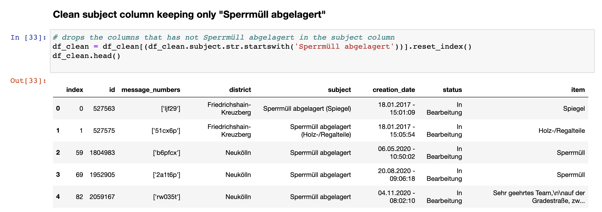
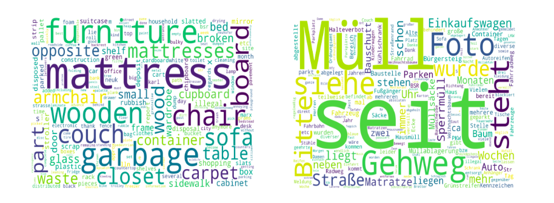
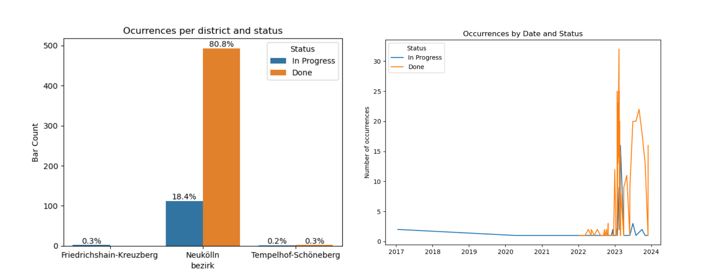
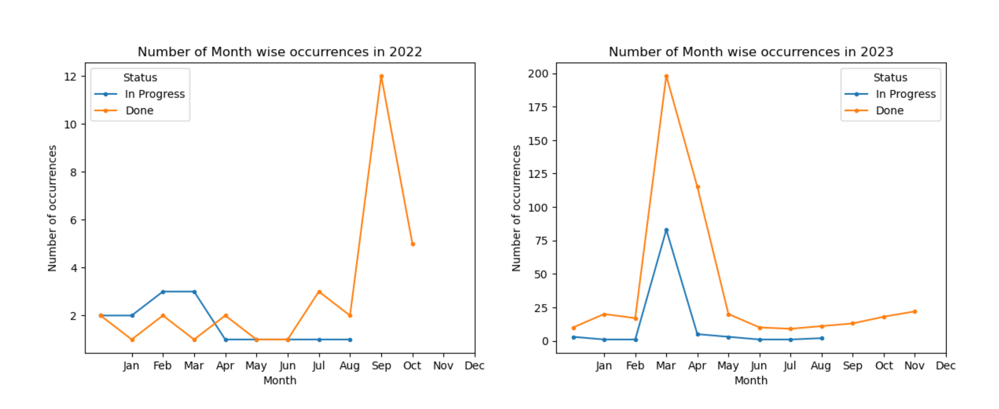

### Analysis of Ordnungsamt data
**This analysis used data freely available on [Berlin Open Data](https://daten.berlin.de/datensaetze/ordnungsamt-online) as API by [Karina Condeixa](https://github.com/KC2016)**

The category "Sperrmüll abgelagert" refers to objects placed on the street that are causing inconvenience to passers-by or to the proper use of public space in the city; and this subset was used for data analysis and visualisation.

Therefore, a sample of the raw dataset with 614 rows and 8 columns was used for our model is shown below. As seen, the columns “bezirk”, “erstellungsDatum”, “status” and ‘”sachverhalt” (“districts”, “creation_date”, “status” and  “item”, respectively, for free translation) are the most indicative to give us insights.

#### 1 Natural language analysis

An analysis of the text from "situation description"  in the  "Sachverhalt" column found the items with higher occurrences, considering the original text in German and the translation in English to reduce inconsistencies that occurred because of English compound words.

I dealt with the text into lines and words: removed numbers and characters, transformed to lowercase, tokenize words, removed stopwords from ntkl package and a hand-crafted word list. Besides counting repeated words, wordclouds for English and German languages were built to visualise the most repeated words and check differences between the two languages.

The most cited items in the dataset translated to English were: `mattress`, `furniture`, `chair`, `closet`, `couch`, `sofa`, `table`, `carpet`, `board`, `wardrobe`, `shelf`, `cabinet`,`frame`, `desk`, `cupboard`, `stroller` and `suitcase`.

The most cited items in the original dataset in German were: `Einkaufswagen`, `Matratze`, `Kuhlschrank`, `Stuhle`, `Fahrrad`, `Tische` and `Sessel`.

#### 2 Occurrences "in process" and "done"
The proportions of occurrences in progress and performed by district and by year were compared in a bar graph and a line graph respectively. An inconsistency was seen in the line graph with occurrences in the future months until the end of 2023.

#### 3 Seasonality
Time-series data with more granularities were done to give an overview of seasonality. Graphs of occurrences by months confirmed an inconsistency in post-dates from this dataset.

#### 4 The main insights from this analysis were:

- Most of the complaints were from Neukölln, 80% of the solved complaints and 18% of the unresolved ones. The numbers of occurrences in other districts are insignificant.
- The data shows a few occurrences in 2022 and a majority in 2023.
-  A massive peak of occurrences was shown in September 2022, but we don't have enough data that indicates a seasonality.
- Hundreds of occurrences in the 'erstellungsDatum'(creation date) column after the day of the analysis showed errors in data for this column.
