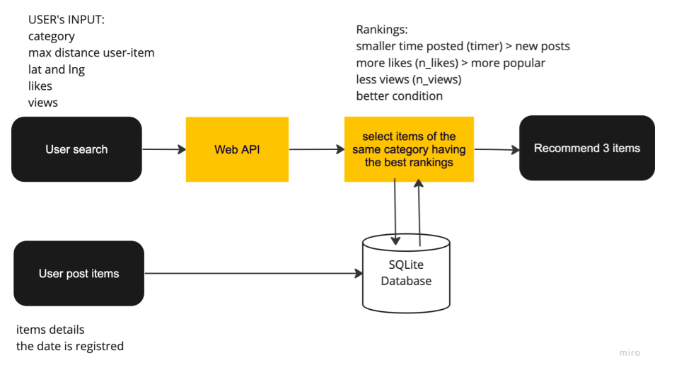
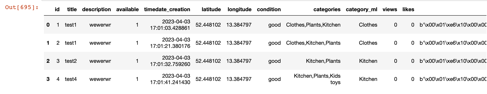
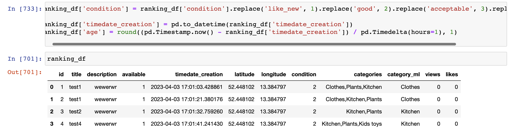
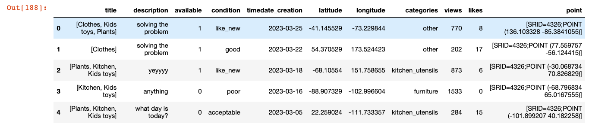

### Recommendation system based on rankings
**by [Karina Condeixa](https://github.com/KC2016)**

[Link for the server](https://www.pythonanywhere.com/%C3%A5%C3%A7/geofree/files/home/geofree/m_l)

Geofree is not a user-based app that is not provided of login feature and doesn’t gather much information about items. So, this solution used events from this app to suggest items based on features of novelty, popularity and item’s condition.


In a nutshell, the data flow for this recommendation is shown below:



 #### 1 Data collection
The table item-list from backend was imported from the backend's SQLite db to python (Jupyter Notebook) and queries using sqlite3 were done. Inputs of users were extracted from the [API from pythoneverywhere](https://geofree.pythonanywhere.com/api/get-categories/) using urllib.parse and requests to get the request of a list of categories that represents input from users when searching items.

The image below shows a visualisations of the data retrieved from the database:



#### 2 Data processing
Data processing took place in the following order:

#### 2.1 Select columns with the necessary features
The features selected were `id`, `available`, `timedate_creation`, `latitude`, `longitude`, `condition`, `categories`, `views` and `likes`.

#### 2.2 Encode categorical column
The column `condition`  was encoded from 1 to 4 instead of `like_new`, `good`, `acceptable`, `poor`, respectively to be ranked.


#### 2.3  Filter by items' avavailability and smaller distance user-item
available = 1 and distance <= the distance chosen by the user in the search.
The distances between items and users who search items are gotten using Cosine similarity; this was calculated together with the backend.

#### 2.4 Ranking the features
The features were ranked as post_creation (descending), number of likes (ascending), number of views (descending) and condition (ascending) and limited to three items recommended.

```
   ranking_df_filtered = ranking_df.copy()
    # filter by categories and available
    ranking_df_filtered = ranking_df_filtered[(ranking_df_filtered['categories'] == chosen_category) & (ranking_df_filtered['available'] == True)]
    # rank these columns
    ranking_df_filtered['timedate_creation_rank'] = ranking_df_filtered['timedate_creation'].rank(method='min', ascending=True)
    ranking_df_filtered['condition_rank'] = ranking_df_filtered['condition'].rank(method='min', ascending=True)
    ranking_df_filtered['views_rank'] = ranking_df_filtered['views'].rank(method='min', ascending=False)
    ranking_df_filtered['likes_rank'] = ranking_df_filtered['likes'].rank(method='min', ascending=False)
    # ranking_df_filtered['age_rank'] = ranking_df_filtered['age'].rank(method='min', ascending=True)
    ranking_df_filtered['overall_rank'] = (ranking_df_filtered['timedate_creation_rank'] + ranking_df_filtered['condition_rank'] + ranking_df_filtered['views_rank'] + ranking_df_filtered['likes_rank']) / 4
    # sort by the higher overall_rank
    ranking_sorted = ranking_df_filtered.sort_values(by='overall_rank', ascending = False)
    # save only the ids
    ranked_id = ranking_sorted['id'] # limit to the 1st, 2nd and 3rd results.
```
Late UX/UI/WD decisions made after the recommender system was developed changed user input to an indefinite number of categories rather than just one. As the system did not foresee multiple entries in categories, I created a condition to resolve this inconsistency; I used only the first category selected in the user's search as input for the filter in the recommendation system.

#### 3 Implementation to the app and testing

#### 3.1 Functions and packaging
A function for data collection and processing was done. And the Python packaging was done with the help of the backend guy (Felipe).  @api_view decorators are used in Django REST framework to specify the allowed HTTP methods for the view function and to handle the request and response data in a RESTful way.

#### 3.2 Challenges in dealing with exceptions
In the implementation, we faced bugs because we had a small list of items and that was not enough to return three items. These errors can occur at the beginning of the use of the app. In response to this issue, I added loopings to check the number of ranked item_ids and when the rankings result in less than three items available from the chosen category, the system recommends random items. This is the snippet of code embedded in the function, which returns create random recommendations in these cases and returns three item_id:

```
# if the length of the list is 0, return 3 random ids
if len(ranked_id) == 0:
    id_1 = random.choice(ranking_df['id'])
    id_2 = random.choice(ranking_df['id'])
    id_3 = random.choice(ranking_df['id'])

# if the length of the list is 1, return the id in the list as id_1  and random ids for id_2 and id_3
elif len(ranked_id) == 1:
    id_1 = list[0]
    id_2 = random.choice(ranking_df['id'])
    id_3 = random.choice(ranking_df['id'])

# if the length of the list is 2, return the ids in the list as id_1, id_2  and random id id_3
elif len(ranked_id) == 2:
    id_1 = list[0]
    id_2 = list[1]
    id_3 = random.choice(ranking_df['id'])

# if the length of the list is 3 or more, return the ids in the list as id_1, id_2, and id_3
else:
    id_1 = list[0]
    id_2 = list[1]
    id_3 = list[3]

id_1 = str(id_1)
id_2 = str(id_2)
id_3 = str(id_3)

return id_1, id_2, id_3
```

#### 3.3 Testing
A mock dataset with 100 records was done to test the function. I used the  following parameters:
A maximum number of views by 2001.
A random number of likes between 0 and 20.
Time creation for posts with a limit of the previous 30 days.
Random latitude and longitude points, timedate_creation, and geographical points using the Faker package.
Random `title`, `description`, `available`, `condition`, `categories`, number of `views` and `likes`  The titles regard to input from the user with category of items. The user can select multiple categories in the search, so I used numpy with lists of lists using the random package.

Lists with some examples of values were created as presented below.

```
title = ['Furniture',  'Clothes', 'All', ['Plants', 'Kitchen', 'Kids toys'], 'All', ['Kitchen', 'Kids toys'], ['Furniture',  'Clothes',  'Kitchen'], ['Kitchen', 'Kids toys'], ['Clothes', 'Kids toys', 'Plants'], 'All']
description = ['anything', 'everything', 'whaterver', 'hellooo', 'testing', 'bug', 'solving the problem', 'what day is today?', 'today is the presentation day', 'we are the second team to present', 'uhuuuu', 'yeyyyy']
category = ['furniture',  'clothes',  'kitchen_utensils', 'kids', 'other']
condition = ['poor', 'acceptable', 'good', 'like_new']
available = ['1', '0']
num_likes_reco = [0,1,2,3,4,5,6,7,8,9,10,11,12,13,24,15,16,17,18,19,20]
```
The function got as described below:
```
def get_random_title():
    random_title = np.random.choice(title)
    if isinstance(random_title, list):
        return random_title
    else:
        return [random_title]
get_random_title()

def data_recommendation(num_reco_records):

    # dictionary
    item ={}
    for i in range(0, num_reco_records):
        item[i] = {}
        fake = Faker()
        item[i]['title']= get_random_title()
        item[i]['description']= np.random.choice(description)
        item[i]['available'] = np.random.choice(available)
        item[i]['condition'] = np.random.choice(condition)
        item[i]['timedate_creation'] = fake.date_between_dates(limit,'now')
        item[i]['latitude'] = float(fake.latitude())
        item[i]['longitude'] = float(fake.longitude())
        item[i]['categories'] = np.random.choice(category)
        item[i]['views'] = np.random.choice(n_views)
        item[i]['likes'] = np.random.choice(num_likes_reco) # not dependent from view, only to test reco
        item[i]['point'] =  [f"SRID=4326;POINT ({fake.longitude()} {fake.latitude()})"]

    return item
```

Later, I added `id`, `category_ml` (a column existing in the database but has no function anymore), ensured that `timedate_creation` was in the correct data type, and formatted it as it is in the database.

```
reco_df['category_ml'] = reco_df['title'].apply(lambda x: x[0])
reco_df['id'] = reco_df.index +1  # add item_id
reco_series = reco_df['id']  # storage in a variable to use later
reco_df['timedate_creation'] = pd.to_datetime(reco_df['timedate_creation'])
reco_df['timedate_creation'] = reco_df['timedate_creation'].dt.strftime('%Y-%m-%d %H:%M:%S.%f')[:-3]
```

We can see below a view of the data frame created.



The backend did tests by his side.

#### 3.4 Performance Metrics
Defining performance metrics for the recommender system for Geofree is tricky because this app is not user-based.  Therefore, I can't use Mean Reciprocal Rank, for example, because this app doesn't record information about which users liked some items.

That said, I could use KPIs(key performance indicators) and A/B testing to measure the performance of the recommendation system.  I cite some examples of KPIs below:

**Customer satisfaction rate (CSR)**

`CSR = (Number of Satisfied Customers/Total number of customers) * 100`

**Average transactions (AVT)**

`AVT = Total revenue / Number of transactions (taken items)`

Where the number of transactions is the number of items selected as taken by the users.

**Number of repeat customers (NRC)**

`NRC = (Number of Unique Customers*Number of Donations)/Total Number of Visits`

This metric can only be applied when login is implemented in Geofree.
